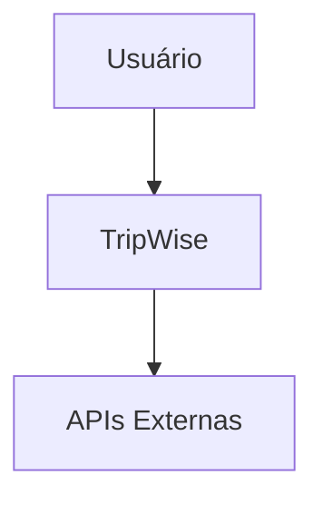
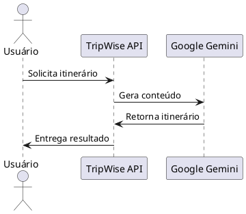

# 📊 Diagramas do Sistema TripWise

Esta pasta contém todos os diagramas arquiteturais e de modelagem do sistema TripWise, seguindo as melhores práticas de documentação técnica.

## 📁 Estrutura dos Diagramas

```
diagramas/
├── README.md                 # Este arquivo
├── c4/                      # Diagramas C4 Model
│   ├── contexto.md          # Nível 1 - Contexto
│   ├── containers.md        # Nível 2 - Contêineres
│   ├── componentes.md       # Nível 3 - Componentes
│   └── codigo.md            # Nível 4 - Código (opcional)
├── er/                      # Diagramas Entidade-Relacionamento
│   ├── modelo-dados.md      # Modelo de dados principal
│   └── perfil-usuario.md    # Modelo de perfil do usuário
├── fluxo/                   # Diagramas de fluxo
│   ├── geracao-itinerario.md # Fluxo de geração de itinerários
│   ├── chat-conversacional.md # Fluxo do chat
│   └── apis-externas.md     # Fluxo de integração com APIs
└── sequencia/               # Diagramas de sequência
    ├── usuario-sistema.md   # Interação usuário-sistema
    └── sistema-apis.md      # Interação sistema-APIs externas
```

## 🎯 Propósito dos Diagramas

### C4 Model
Documenta a arquitetura do sistema em diferentes níveis de abstração:
- **Contexto**: Visão geral do sistema e seus usuários
- **Contêineres**: Aplicações e serviços que compõem o sistema
- **Componentes**: Módulos internos de cada contêiner
- **Código**: Detalhes de implementação (quando necessário)

### Diagramas ER
Modelam a estrutura de dados e relacionamentos:
- Perfis de usuário e preferências
- Itinerários e suas componentes
- Histórico de interações

### Diagramas de Fluxo
Ilustram processos de negócio:
- Jornada do usuário
- Processamento de dados
- Integração com serviços externos

### Diagramas de Sequência
Detalham interações temporais:
- Comunicação entre componentes
- Fluxo de dados em tempo real
- Tratamento de erros

## 🛠️ Ferramentas Utilizadas

### Mermaid
Para diagramas em formato texto (recomendado):
```markdown

```

### PlantUML
Para diagramas mais complexos:


### Lucidchart
Para diagramas colaborativos e apresentações.

## 📋 Convenções

### Nomenclatura
- Arquivos em português com hífens: `geracao-itinerario.md`
- Títulos descritivos e claros
- Versionamento quando necessário: `v1.0`, `v2.0`

### Formato
- Markdown com diagramas embarcados
- Explicações em português
- Exemplos práticos quando aplicável
- Links para código relacionado

### Atualização
- Diagramas devem ser atualizados junto com mudanças no código
- Versionar diagramas importantes
- Documentar decisões arquiteturais

## 🔄 Processo de Atualização

1. **Mudança no Sistema**: Quando há alterações arquiteturais
2. **Atualizar Diagramas**: Modificar os diagramas afetados
3. **Revisar Consistência**: Verificar se todos os níveis estão alinhados
4. **Documentar Mudanças**: Explicar o que mudou e por quê
5. **Validar com Equipe**: Revisar com outros desenvolvedores

## 📚 Como Usar

### Para Desenvolvedores
1. **Consulte** os diagramas antes de implementar novas funcionalidades
2. **Atualize** os diagramas quando fizer mudanças arquiteturais
3. **Use** como referência para entender o sistema

### Para Novos Membros
1. **Comece** pelo diagrama de contexto
2. **Aprofunde** nos contêineres e componentes
3. **Consulte** os fluxos para entender processos

### Para Stakeholders
1. **Foque** nos diagramas de contexto e contêineres
2. **Use** os fluxos para entender a jornada do usuário
3. **Consulte** para validar requisitos

## 🎨 Metodologia AIDesign

Os diagramas seguem a metodologia AIDesign aplicada no projeto:

### Canvas de Design de Prompts
- Documentado em diagramas de fluxo da IA
- Mostra como prompts são construídos e processados

### Canvas de Testes e Validação
- Refletido em diagramas de sequência
- Mostra pontos de validação e teste

### Decisões Arquiteturais
- Documentadas junto aos diagramas
- Explicam o "porquê" das escolhas técnicas

---

**Nota**: Esta documentação visual é essencial para manter a qualidade e consistência do sistema TripWise. Mantenha-a sempre atualizada! 📈