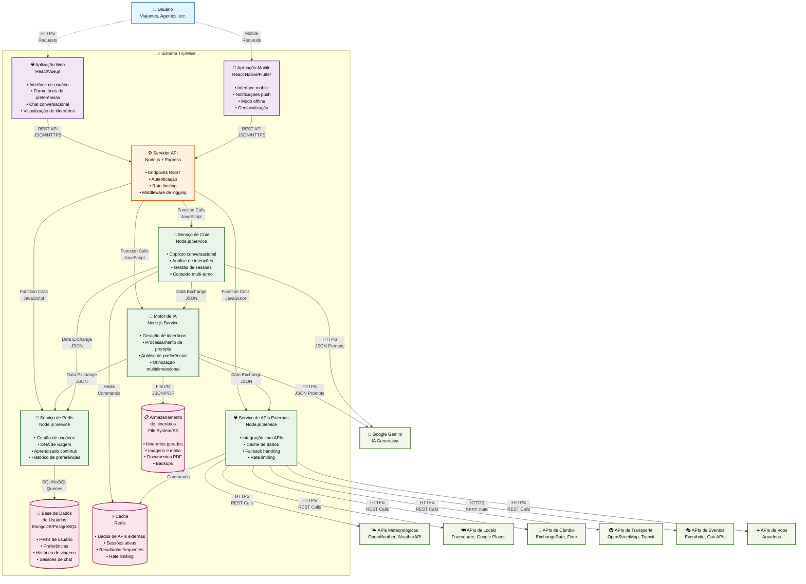

# Diagrama de Contêineres - TripWise (C4 Nível 2)

## Visão Geral

Este diagrama detalha a arquitetura interna do sistema TripWise, mostrando os contêineres (aplicações, serviços, bancos de dados) que compõem o sistema e como eles interagem.

## Diagrama



## Descrição dos Contêineres

### 🌐 Camada de Apresentação

#### Aplicação Web
- **Tecnologia**: React.js
- **Responsabilidades**:
  - Interface de usuário responsiva
  - Formulários de coleta de preferências
  - Chat conversacional em tempo real
  - Visualização de itinerários gerados
  - Gestão de estado da aplicação
- **Características**:
  - SPA (Single Page Application)
  - PWA (Progressive Web App) capabilities
  - Otimizada para SEO
  - Suporte a múltiplos idiomas

#### Aplicação Mobile
- **Tecnologia**: React Native ou Flutter
- **Responsabilidades**:
  - Interface mobile nativa
  - Notificações push
  - Funcionalidades offline
  - Integração com GPS/geolocalização
- **Características**:
  - Cross-platform (iOS/Android)
  - Sincronização com versão web
  - Cache local para modo offline
  - Integração com calendário do dispositivo

### ⚙️ Camada de API

#### Servidor API
- **Tecnologia**: Node.js + Express.js
- **Responsabilidades**:
  - Endpoints REST para todas as funcionalidades
  - Autenticação e autorização
  - Rate limiting e throttling
  - Middleware de logging e monitoramento
  - Validação de dados de entrada
- **Características**:
  - Arquitetura RESTful
  - Documentação OpenAPI/Swagger
  - CORS configurado
  - Compressão gzip
  - Health checks

### 🔧 Camada de Serviços

#### Motor de IA
- **Tecnologia**: Node.js com módulos especializados
- **Responsabilidades**:
  - Orquestração da geração de itinerários
  - Construção de prompts estruturados
  - Processamento de respostas da IA
  - Otimização multidimensional
  - Validação de conteúdo gerado
- **Características**:
  - Modular e extensível
  - Cache de prompts frequentes
  - Fallback para dados estáticos
  - Métricas de qualidade

#### Serviço de Chat
- **Tecnologia**: Node.js com WebSocket support
- **Responsabilidades**:
  - Análise de intenções do usuário
  - Gestão de sessões conversacionais
  - Manutenção de contexto multi-turno
  - Geração de respostas contextuais
- **Características**:
  - Real-time messaging
  - Análise de sentimento
  - Histórico de conversas
  - Sugestões proativas

#### Serviço de Perfis
- **Tecnologia**: Node.js com ORM/ODM
- **Responsabilidades**:
  - Gestão de perfis de usuário
  - Cálculo do DNA de viagem
  - Aprendizado contínuo baseado em feedback
  - Análise de padrões comportamentais
- **Características**:
  - Machine learning integrado
  - Versionamento de perfis
  - Privacidade por design
  - Exportação de dados (GDPR)

#### Serviço de APIs Externas
- **Tecnologia**: Node.js com HTTP clients
- **Responsabilidades**:
  - Integração com múltiplas APIs externas
  - Cache inteligente de dados
  - Handling de falhas e timeouts
  - Rate limiting distribuído
- **Características**:
  - Circuit breaker pattern
  - Retry logic com backoff
  - Agregação de dados
  - Monitoramento de SLA

### 💾 Camada de Dados

#### Base de Dados de Usuários
- **Tecnologia**: MongoDB ou PostgreSQL
- **Responsabilidades**:
  - Armazenamento de perfis de usuário
  - Histórico de preferências e viagens
  - Sessões de chat persistentes
  - Configurações de conta
- **Características**:
  - Backup automático
  - Replicação para alta disponibilidade
  - Índices otimizados
  - Criptografia em repouso

#### Cache
- **Tecnologia**: Redis
- **Responsabilidades**:
  - Cache de dados de APIs externas
  - Sessões ativas de usuários
  - Rate limiting distribuído
  - Resultados de consultas frequentes
- **Características**:
  - TTL configurável
  - Clustering para escalabilidade
  - Persistência opcional
  - Pub/Sub para eventos

#### Armazenamento de Itinerários
- **Tecnologia**: File System local ou AWS S3
- **Responsabilidades**:
  - Armazenamento de itinerários gerados
  - Imagens e conteúdo multimídia
  - Documentos PDF exportados
  - Backups e versionamento
- **Características**:
  - CDN para distribuição global
  - Compressão automática
  - Lifecycle policies
  - Acesso controlado

## Fluxos de Dados Principais

### 1. Geração de Itinerário via Formulário
```
Web App → API Server → AI Engine → External API Service → [APIs] → AI Engine → Gemini → AI Engine → Itinerary Storage → API Server → Web App
```

### 2. Chat Conversacional
```
Web App → API Server → Chat Service → Profile Service → Chat Service → Gemini → Chat Service → Cache → API Server → Web App
```

### 3. Criação de Perfil
```
Web App → API Server → Profile Service → User DB → Profile Service → API Server → Web App
```

### 4. Atualização de Dados Externos
```
External API Service → [APIs Externas] → External API Service → Cache → [Outros Serviços]
```

## Padrões Arquiteturais Aplicados

### Microserviços
- **Separação de responsabilidades**: Cada serviço tem uma função específica
- **Independência de deploy**: Serviços podem ser atualizados independentemente
- **Escalabilidade granular**: Escalar apenas os serviços necessários

### API Gateway
- **Ponto único de entrada**: API Server atua como gateway
- **Cross-cutting concerns**: Autenticação, logging, rate limiting centralizados
- **Roteamento inteligente**: Direcionamento para serviços apropriados

### Cache-Aside Pattern
- **Performance**: Dados frequentes em cache
- **Redução de latência**: Menos chamadas para APIs externas
- **Fallback**: Dados em cache quando APIs falham

### Circuit Breaker
- **Resiliência**: Proteção contra falhas em cascata
- **Graceful degradation**: Funcionalidade reduzida quando serviços falham
- **Auto-recovery**: Tentativas automáticas de reconexão

## Considerações de Deployment

### Containerização
```dockerfile
# Exemplo para API Server
FROM node:20-alpine
WORKDIR /app
COPY package*.json ./
RUN npm ci --only=production
COPY src ./src
EXPOSE 3000
CMD ["npm", "start"]
```

### Orquestração
- **Docker Compose**: Para desenvolvimento local
- **Kubernetes**: Para produção em nuvem
- **Health checks**: Monitoramento de saúde dos contêineres

### Escalabilidade
- **Horizontal scaling**: Múltiplas instâncias dos serviços
- **Load balancing**: Distribuição de carga
- **Auto-scaling**: Baseado em métricas de CPU/memória

## Segurança

### Autenticação e Autorização
- **JWT tokens**: Para autenticação stateless
- **OAuth 2.0**: Para integração com provedores externos
- **RBAC**: Role-based access control

### Comunicação Segura
- **HTTPS**: Todas as comunicações externas
- **TLS**: Comunicação entre serviços
- **API Keys**: Armazenadas como secrets

### Proteção de Dados
- **Criptografia**: Dados sensíveis em repouso
- **Sanitização**: Validação de entrada
- **Rate limiting**: Proteção contra ataques

## Monitoramento e Observabilidade

### Logging
- **Structured logging**: JSON format
- **Correlation IDs**: Rastreamento de requests
- **Log aggregation**: Centralização de logs

### Métricas
- **Application metrics**: Performance dos serviços
- **Business metrics**: KPIs do negócio
- **Infrastructure metrics**: Recursos do sistema

### Tracing
- **Distributed tracing**: Rastreamento de requests
- **Performance profiling**: Identificação de gargalos
- **Error tracking**: Monitoramento de erros

---

**Próximo Nível**: [Diagrama de Componentes](componentes.md) - Detalhamento interno dos serviços