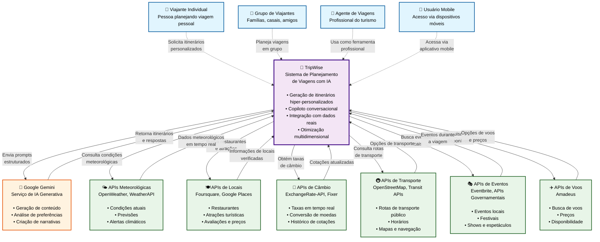

# Diagrama de Contexto - TripWise (C4 Nível 1)

## Visão Geral

Este diagrama mostra o sistema TripWise em seu contexto, incluindo os usuários e sistemas externos com os quais interage.

## Diagrama



## Descrição dos Elementos

### 👥 Usuários do Sistema

#### Viajante Individual
- **Perfil**: Pessoa planejando viagem pessoal
- **Necessidades**: Itinerários personalizados, recomendações baseadas em preferências
- **Interações**: Formulário de preferências, chat conversacional

#### Grupo de Viajantes
- **Perfil**: Famílias, casais, grupos de amigos
- **Necessidades**: Itinerários que atendam múltiplas preferências, atividades em grupo
- **Interações**: Planejamento colaborativo, consenso de preferências

#### Agente de Viagens
- **Perfil**: Profissional do setor turístico
- **Necessidades**: Ferramenta para criar propostas rapidamente
- **Interações**: Interface profissional, múltiplos clientes

#### Usuário Mobile
- **Perfil**: Acesso via dispositivos móveis
- **Necessidades**: Interface responsiva, agilidade em viagens
- **Interações**: App web

### 🚀 Sistema Principal: TripWise

**Responsabilidades**:
- Orquestrar a geração de itinerários hiper-personalizados
- Fornecer interface conversacional natural
- Integrar dados de múltiplas fontes externas
- Otimizar recomendações baseadas em múltiplos critérios
- Gerenciar perfis de usuário e aprendizado contínuo

**Características Principais**:
- **Hiper-Personalização**: DNA de viagem único para cada usuário
- **Inteligência Conversacional**: Chat natural em português
- **Dados Reais**: Integração com APIs externas para informações atualizadas
- **Otimização Multidimensional**: Equilibra orçamento, tempo, logística e interesses

### 🤖 Sistema de IA: Google Gemini

**Responsabilidades**:
- Processar prompts estruturados do TripWise
- Gerar conteúdo narrativo para itinerários
- Analisar preferências e inferir padrões
- Responder perguntas conversacionais

**Integração**:
- API REST com autenticação por chave
- Prompts otimizados para turismo
- Processamento de contexto em português

### 🌐 Sistemas Externos

#### APIs Meteorológicas
- **OpenWeatherMap**: Dados globais, 1.000 chamadas/dia gratuitas
- **WeatherAPI**: Previsões detalhadas, 1M chamadas/mês gratuitas
- **Dados fornecidos**: Temperatura, condições, previsão 5 dias

#### APIs de Locais
- **Foursquare**: Locais verificados, 50 chamadas/dia gratuitas
- **Google Places**: Dados abrangentes, $200 crédito/mês
- **Dados fornecidos**: Restaurantes, atrações, avaliações, preços

#### APIs de Câmbio
- **ExchangeRate-API**: Totalmente gratuita
- **Dados fornecidos**: Taxas em tempo real, conversões

#### APIs de Voos
- **Amadeus**: API comercial para busca de voos
- **Dados fornecidos**: Voos disponíveis, preços, horários

## Fluxos Principais

### 1. Geração de Itinerário
```
Usuário → TripWise → [APIs Externas] → Google Gemini → TripWise → Usuário
```

### 2. Chat Conversacional
```
Usuário → TripWise → Google Gemini → TripWise → Usuário
```

### 3. Atualização de Dados
```
TripWise → APIs Externas → TripWise (Cache/Processamento)
```

## Benefícios da Arquitetura

### Para Usuários
- **Experiência Unificada**: Uma interface para múltiplas fontes de dados
- **Informações Atualizadas**: Dados reais de clima, preços, eventos
- **Personalização Avançada**: IA que aprende com preferências
- **Conveniência**: Planejamento completo em uma plataforma

### Para o Sistema
- **Escalabilidade**: APIs externas absorvem carga de dados
- **Confiabilidade**: Múltiplas fontes para redundância
- **Flexibilidade**: Fácil adição de novas APIs
- **Custo-Efetividade**: Uso de APIs gratuitas quando possível

## Considerações de Segurança

- **Chaves de API**: Armazenadas como variáveis de ambiente
- **Rate Limiting**: Controle de chamadas para APIs externas
- **Fallback**: Dados genéricos quando APIs falham
- **Privacidade**: Dados do usuário não compartilhados com APIs externas

## Limitações e Restrições

- **Dependência de Internet**: Requer conectividade para funcionalidade completa
- **Limites de API**: Quotas gratuitas podem limitar uso intensivo
- **Latência**: Múltiplas chamadas de API podem afetar performance
- **Disponibilidade**: Falhas em APIs externas afetam funcionalidades específicas

---

**Próximo Nível**: [Diagrama de Contêineres](containers.md) - Detalhamento da arquitetura interna do TripWise